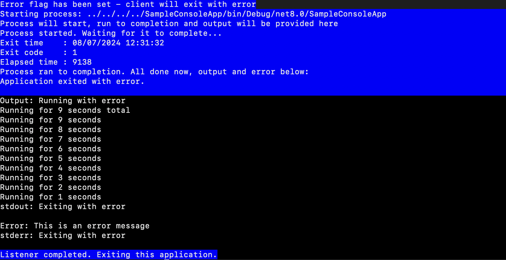

# Sysdiag.poc

This is a short proof-of-concept to demo how one .NET application can run a different application and capture its output for further processing. 

This isn't meant to be pretty or useful in any way, but the target here was .net 8 running in a Linux environment. 

## Sample output

## Console app
This app starts, picks a random duration and takes that many seconds to run before it completes. Optional error parameter to trigger a different exitcode. 

## Listener
This application starts, prints some info before launching the console app. The point here is that the listener waits for the console app to complete before capturing stdout and stderr along with its exit code. 